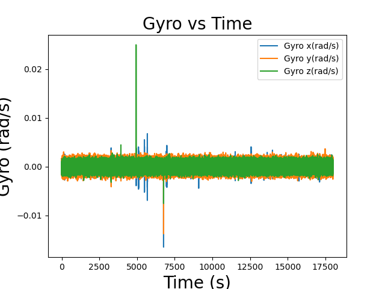

# ROS-navigation-stack-using-IMU-and-RTK-GPS
This repo contains the ROS drivers and analysis of navigation sensors like IMU and RTK based GPS.
This analysis was done for comparing the output data and performance of standard GPS puck and RTK based GPS sensoor. More details about the hardware setup and data collection cann be seen in the pdf report of respective folders.
Further more for IMU VN-100 was used and allan deviation analysis was performed on top of it for determining it performance.

